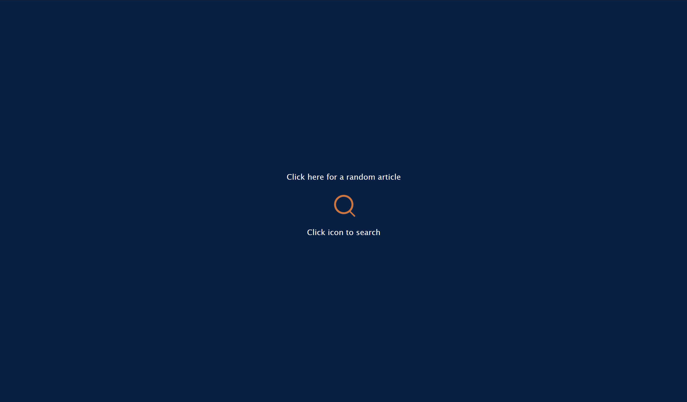
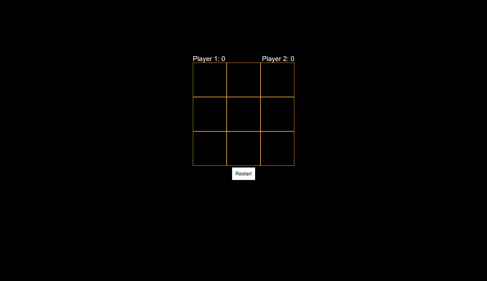

# Hi, I'm Francesco Muntoni 👋

💻 **Aspiring Cybersecurity Specialist** | 🐍 Python Developer | 🌐 Web Designer

---

## 🚀 About Me
- 🎓 Completed Google Cybersecurity Certificate
- 💼 Experience automating databases with Python + HTML
- 🏆 National programming competition finalist at 16
- 🔐 Interested in cybersecurity, AI, and software development
- 📍 Based in Italy, Milan

---

## 📂🌐 Web Design Projects

### 🔹 [📰 Wikipedia Viewer](https://codepen.io/Muntoni/full/qByaLXV)
Search Wikipedia articles through a clean web interface with live API results.  
*Built with:* HTML, CSS, JavaScript  

---

### 🔹 [❌⭕ Tic Tac Toe Game](https://codepen.io/Muntoni/full/ExpgypK)
Interactive tic-tac-toe game with win detection and reset functionality.  
*Built with:* HTML, CSS, JavaScript  

---

### 🔹 [🧮 iOS Calculator](https://codepen.io/Muntoni/full/wvxzWXE)
A fully functional calculator inspired by iOS design.  
*Built with:* HTML, CSS, JavaScript

---

### 🔹 [🎨 Drawing App](https://codepen.io/Muntoni/full/QWBKErY)
A simple web-based drawing application with customizable colors and brush sizes.  
*Built with:* HTML, CSS, JavaScript

---

### 🔹 [🛍️ Product Landing Page](https://codepen.io/Muntoni/full/poZELoZ)
A responsive landing page with sections for product features and pricing.
*Built with:* HTML, CSS

---

### 🔹 [📄 Technical Documentation Page (Python)](https://codepen.io/Muntoni/full/qByaodE)
Documentation-style page built to explain Python basics with navigation sidebar.  
*Built with:* HTML, CSS

---

### 🔹 [💼 Portfolio Website](https://codepen.io/Muntoni/full/wvxzNBK)
A personal portfolio site showcasing my web projects and contact information.  
*Built with:* HTML, CSS

---

### 🔹 [🏛️ Tribute Page](https://codepen.io/Muntoni/full/wvxzmMp)
A clean tribute page layout with timeline and media sections.  
*Built with:* HTML, CSS

---

### 🔹 [📝 Survey Form](https://codepen.io/Muntoni/full/oNMzqzx)
Clean survey form layout with multiple input types and validations.  
*Built with:* HTML, CSS

---

## 📂🐍 Python Projects

### 🔹 [💰 Budget App](assets/budget_app.py)
A personal finance tool implemented in Python. Allows tracking deposits, withdrawals, and transfers between categories, and generates a visual chart of spending by category.
*Built with:* Python

---

### 🔹 [🎲 Probability Calculator](assets/probability_calculator.py)
Simulates random draws from a hat filled with colored balls to estimate probabilities. Uses Monte Carlo simulation to determine the likelihood of drawing a desired combination.
*Built with:* Python, copy, random

---

### 🔹 [⏰ Time Calculator](assets/time_calculator.py)
Adds a duration to a start time and calculates the resulting time, handling AM/PM, day changes, and optional weekdays.
*Built with:* Python

---

### 🔹 [➕➖ Arithmetic Arranger](assets/arithmetic_arranger.py)
Solves and formats a list of basic arithmetic problems (addition and subtraction) for display. Handles errors like too many problems or numbers with too many digits.
*Built with:* Python

---

### 🔹 [▭ Polygon Area Calculator](assets/polygon_area_calculator.py)
Calculates geometric properties of rectangles and squares, including area, perimeter, diagonal, and how many times one shape fits inside another. Can also draw a text-based representation.
*Built with:* Python

---

## 📜 Certifications
- 🛡️ **Google Cybersecurity Certificate** – [View Certificate](https://coursera.org/share/a1e290e0db603405e29dc2e231d9bc1d)
- 🤖 **Google AI Essentials** - [View Certificate](https://coursera.org/share/f3613dd6eda0402d582bc86ef25164d7)
- 🌐 **Responsive Web Design** - [View Certificate](https://www.freecodecamp.org/certification/francesco_muntoni/responsive-web-design)
- 🐍 **Scientific Computing with Python** - [View Certificate](https://www.freecodecamp.org/certification/francesco_muntoni/scientific-computing-with-python-v7)
- 💻 **ICDL Full Standard** - [View Certificate](assets/ICDL.pdf)
- 🇬🇧  **GRADE A in First Certificate in English** - [View Certificate](assets/firstCertificate.pdf)
---

## 📫 Contact Me
- **Email:** francescomuntoni2005@gmail.com
- **LinkedIn:** www.linkedin.com/in/francesco-muntoni-a3507b257
- **GitHub:** https://github.com/Muntoni

---
*Thanks for visiting my portfolio!*

